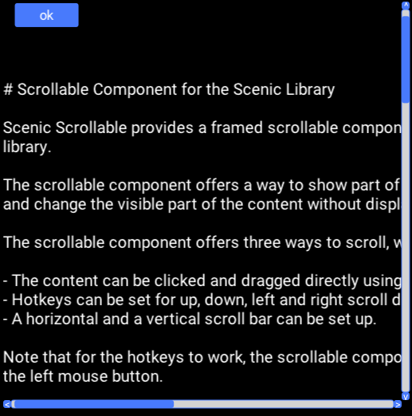
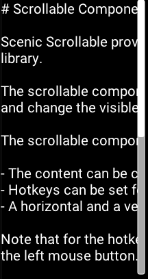

# Scrollable Component for the Scenic Library

Scenic Scrollable provides a framed scrollable component for the [Scenic](https://hex.pm/packages/scenic) library.

The scrollable component offers a way to show part of a content group bounded by a fixed rectangle or frame, and change the visible part of the content without displacing the bounded rectangle by scrolling.

The scrollable component offers three ways to scroll, which can be used in conjunction:

- The content can be clicked and dragged directly using a mouse.
- Hotkeys can be set for up, down, left and right scroll directions.
- A horizontal and a vertical scroll bar can be set up.

Note that for the hotkeys to work, the scrollable component has to catch focus first by clicking it once with the left mouse button.



## Getting Started

Install and setup [Scenic](https://hex.pm/packages/scenic).
Make a new project using the following command.

```
$ mix archive.install hex scenic_new
```

Add the following dependency to your mix.exs file.

```
{:scenic_scrollable, "~> 0.1"}
```

And pull the depencency.

```
$ mix deps.get
```

You can add a scrollable component to a graph by using `Scenic.Scrollable.Components.scrollable/4`.

## Examples

```
graph = Scenic.Scrollable.Components.scrollable(
  Scenic.Graph.build(),
  %{
    frame: {200, 400},
    content: %{x: 0, y: 10, width: 200, height: 800}
  },
  fn graph ->
    {:ok, text} = File.read("README.md")
    Scenic.Primitives.text(graph, text)
  end,
  [
    id: :scrollable_component_1,
    vertical_scroll_bar: []
  ]
)
```



```
graph = Scenic.Scrollable.Components.scrollable(
  Scenic.Graph.build(),
  %{
    frame: {200, 400},
    content: %{x: 0, y: 10, width: 400, height: 800}
  },
  fn graph ->
    {:ok, text} = File.read("README.md")
    Scenic.Primitives.text(graph, text)
  end,
  [
    scroll_position: {-10, -50},
    scroll_acceleration: %{
      acceleration: 15,
      mass: 1.2,
      counter_pressure: 0.2
    },
    scroll_hotkeys: %{
      up: "w",
      down: "s",
      left: "a",
      right: "d"
    },
    scroll_fps: 15,
    scroll_drag: %{
      mouse_buttons: [:left]
    },
    scroll_bar_thickness: 15,
    horizontal_scroll_bar: [
      scroll_buttons: false,
      scroll_bar_theme: Scenic.Primitive.Style.Theme.preset(:danger)
    ],
    vertical_scroll_bar: [
      scroll_buttons: true,
      scroll_bar_theme: Scenic.Primitive.Style.Theme.preset(:primary)
    ],
    translate: {50, 50},
    id: :scrollable_component_2
  ]
)
```


